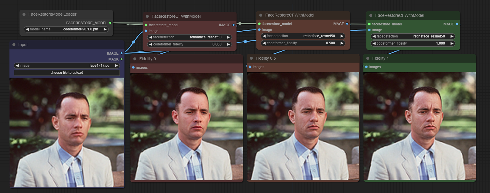

# Facerestore CF (Code Former)

## Note
> This is a copy of [facerestore custom node](https://civitai.com/models/24690/comfyui-facerestore-node) with a bit of a change to support CodeFormer Fidelity parameter.

These ComfyUI nodes can be used to restore faces in images similar to the face restore option in AUTOMATIC1111 webui.




## Installation

Git clone this node to `ComfyUI/custom_nodes` folder:

```bash
cd ComfyUI/custom_nodes
git clone https://github.com/mav-rik/facerestore_cf.git
```

If running the portable windows version of ComfyUI, run embedded_install.bat
Windows users not running the portable version can run install.bat. Linux and mac users can run install.sh.
If the install fails for whatever reason, you'll need to work out how to install opencv-python yourself (you'll get a cv2 not found error otherwise).
If you are using Python3.12 or higher version, please use `requirements_312.txt`.


## Face Restoration Models
These models perform the face restoration. If you use automatic1111 you probably already have them but if not here are the download links.
Just put them in models/facerestore_models.

https://github.com/TencentARC/GFPGAN/releases/
https://github.com/TencentARC/GFPGAN/releases/download/v1.3.4/GFPGANv1.4.pth

https://github.com/sczhou/CodeFormer/releases/
https://github.com/sczhou/CodeFormer/releases/download/v0.1.0/codeformer.pth


## Face detection models
The face restoration model only works with cropped face images. A face detection model is used to send a crop of each face found to the face restoration model.
These will automaticly be downloaded and placed in models/facedetection the first time each is used.
Here's the links if you'd rather download them yourself.

https://github.com/xinntao/facexlib/releases/download/v0.1.0/detection_Resnet50_Final.pth
https://github.com/xinntao/facexlib/releases/download/v0.1.0/detection_mobilenet0.25_Final.pth
https://github.com/sczhou/CodeFormer/releases/download/v0.1.0/yolov5l-face.pth
https://github.com/sczhou/CodeFormer/releases/download/v0.1.0/yolov5n-face.pth

This also gets downloaded and put in the facedetection folder. It's used to put the restored faces back into the original image.
https://github.com/sczhou/CodeFormer/releases/download/v0.1.0/parsing_parsenet.pth